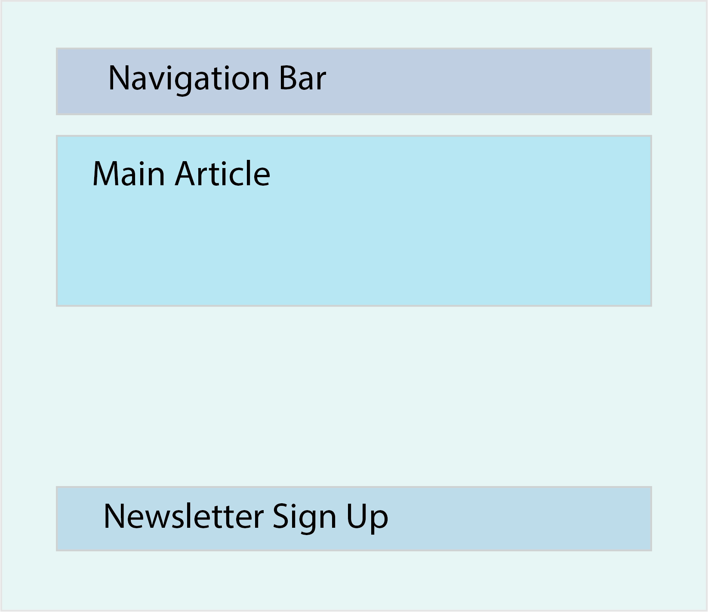

### ReactJs Introduction

The last lesson has given you a quick overview about the three most popular Frontend Frameworks (Vue.js, Angular, React.js). This section aims to provide you with all you need to know about React, to feel the power of a Frontend Framework and also to help you create highly scalable React applications and beautiful websites. But before we jump right into it we need to answer one question.

### Why React?

As you already know from the previous section, React is one of the most powerful and widely used Frontend frameworks. If you have done the previous lesson and are here because you decided react is the framework to go for, you can skip this "Why React?" part of this lesson. However if you just stumbled over this, or if you are still unsure about weather to learn react or not, let me convince you.

If might make you skeptical, because the landscape for frameworks has been changing a lot over the last few year, and you don't want to go for the "wrong" one.

You are right, frontend frameworks seem to have changed quite a bit over the last few years, as [this](https://stackoverflow.blog/2018/01/11/brutal-lifecycle-javascript-frameworks/) article shows quite well. Nevertheless, once you started diving deeper in a Framework you will start loving it, I promise. It makes your coding scalable, much more readable and probably a thousand times more efficient (just my modest estimation).

Just to name a few reasons why to learn React.js:

- Reusability of components
- Amazing community
- React is unopinionated, which means that it won't force you to follow any specific patterns or logics, it's all up to you.
- Pretty easy to learn, especially when you already have a good grasp of JavaScript and Html, which you do when you followed the previous courses
- React uses the virtual DOM, which makes it extremely fast and efficient

If you need more convincing check out [this](https://medium.com/@SilentHackz/top-10-reasons-why-you-should-learn-react-right-now-f7b0add7ec0d) article and [this](https://medium.com/@cassiozen/10-reasons-why-every-developer-should-learn-react-87fbfef2cb91).

_convinced and excited? Great, because it's gonna change your life. Let's dive right into it._

### Components

Everything in React is made of (reusable) components, they are your building blocks in react. In order to be confident using react, you should learn to divide your application or project into components. The following picture gives you an idea how to do that with a very basic app.



For example this simple blog website could be divided into the following sections (components):

- App.js which represents your main application and which will be the parent of all the other components
- Navbar.js which will the the Navigation bar
- MainArticle.js which will be the component that renders your content
- NewletterForm.js which is a simple form, that let's a user input his email to receive the weekly Newsletter

In React each component is an own ES6 module, which is per se independent. But through the in ES6 introduced `import` statement you can import components into other components like so:
`import ExampleComponent from "./components/ExampleComponent`. (Which we would do in App.js, which is in our example the parent to all other components)
This gives you the freedom to structure your components to your will. At the beginning it might be a little bit difficult to find out the best component structure, especially when state and props come into play, but that's the topic for the next sections. Don't worry too much about the component structur for now, this comes with experience, you'll figure it out. React components in general can and usually have parent- or child components. This system of structuring your applications component-base helps to keep your code structured and makes it easy to keep track of your components relationships with each other.

An very basic component looks like this:

```
import React, { Component } from 'react'

class App extends Component {
    constructor() {
        super()
    }

    {"Javascript functions can we written here"}

    render() {
        return (
            <div className="App">
            Hello World!
            </div>
        )
    }
}

export default App
```

Don't get overwhelmed it isn't as difficult as it might look at the beginning. Let's walk through it step by step.

1. We import React, { Component } from "react" which just allows us to ....
2. Second we declare a so called class component, which really is just a Javascript class, that extends Component, which we imported earlier. One thing to notice is that React components should always be declared with a capital letter at the beginning.
3. You see the constructor, which we also have in a javascript class. A Constructor is not obligatory in a class component, but most likely you will encounter one, because it gets quite important when we get to concepts like inheritance and state. So to get used to it, it's already included here. In React you pass "props" as an argument to the constructor and also to the super() call, which has to be called in any constructor. You will not learn about props here, we discuss this in the next lesson, but in short, props are used in react to pass properties from a parent component to child components. But as I said, don't worry too much about that now, we will talk about it in full later on.
4. What might look a little bit weird at first, is the comment, in React you write comments within curly brackets and quotes.
5. And the probably most unfamiliar thing is the render function, which returns something that looks like HTML, but is actually JSX. And that's already one of the main things about react, the ability to combine Javascript and JSX. JSX is really nothing else than an HTML like syntax that will be transpiled by transpilers like babel to Javascript yin order for a browser to be able to read it. One thing you should know about JSX is that you can't use the in HTML protected words, such as "class" or "onchange". That's why instead of "class" you write "className" and instead of "onchange" you write "onChange". In general all attributes in JSX are written in camel-case. You should be fairly familiar with that from the naming convention of variables in Javascript. The render function you see is the most used React life-cycle function (more to that in another section). The only thing you should know for now is that every React class component needs a render function, which returns _one_ JSX element. So whatever you want to return needs to be wrapped in a single element.

However, class components are just one way of defining a React component, another one are functional components.

A basic functional component looks like the following

```
import React from "react";

const App = () => {
    return (
        <div className="App">
            Hello World!
        </div>
    )
}

export default App;
```

As you can see, there are a couple differences of functional and class based components.

1. We don't have to import and extend "Components" from react;
2. We don't need a constructor.
3. We don't need the render function, but instead a return statement

There are more differences, which we will encounter when talking about props and state.

For a better basis of react components read [this](https://dev.to/sarah_chima/an-introduction-to-react-components-cke) short article, it provides a great overview.

For further understanding of the difference between functional and class based components read [this](https://medium.com/@Zwenza/functional-vs-class-components-in-react-231e3fbd7108) article. They are already talking about concepts like state and life-cycle methods, which we haven't talked about yet. But keep it already in mind, because it will prove usefull later on.

### Create-react-app

Developers at facebook came up with a great tool called create-react-app, which sets up a complete react app for you, by just running one command it does all the necessary setup and confguration in order for you to start directly with your project.

If you want to see all the things we have discussed in action, go ahead an run `$ npx create-react-app my-first-react-app` in your terminal and cd into the project `cd my-first-react-app` then open it in your text editor of choice. If you want you can run the project through the command `npm start`

### Index.js and App.js

Two of the most important files Create-react-app includes for you are index.js and App.js. Index.js is the entry point of your application by default. It looks somewhat like this. The line I want to highlight is the following:
``ReactDOM.render(<App />, document.getElementById('root'))`
In short, what this line of code does it that it tells react to render the App component into the DOM, exactly into the element with the id "root". Every create-react-app project has a root div, which is visible in the index.html file in your public directory. That means, should you decide to name your main application component different than App.js, make sure to change the index.js as well.

If you want to get a better understanding of how create-react-app works and which files it creates for you, make sure to check out [this](https://blog.logrocket.com/getting-started-with-create-react-app-d93147444a27/) great article and watch [this](https://www.youtube.com/watch?v=rUdtgnwrA14) video to really understand the file system create-react-app sets up for you.

### Learning Outcomes

- Why you should learn React?
- What is JSX?
- What is a React Component?
- What is the difference between a functional and a class based component
- How can you structure your application into components?
- Understanding create-react-app and the files it creates for you

### Assignment

<div class="lesson-content__panel" markdown="1">
1. React the first couple of pages of the react.js documentation. In general their documentation is a great ressource for comming back at a later time if you have to get more familiar with certain concepts or have to fresh up something. So let's get started. Read [this](https://reactjs.org/docs/hello-world.html), [this](https://reactjs.org/docs/introducing-jsx.html), [this](https://reactjs.org/docs/rendering-elements.html) and [this](https://reactjs.org/docs/components-and-props.html) article. In the last one they already introduce the concept of props. We haven't looked at that yet, so don't worry too much about it, but it can't hurt having a look at it.
2. Watch [this](https://www.youtube.com/watch?v=JPT3bFIwJYA&list=PL55RiY5tL51oyA8euSROLjMFZbXaV7skS) video to get another quick explanation of react. And then watch those ([one](https://www.youtube.com/watch?v=G40iHC-h0c0&list=PL55RiY5tL51oyA8euSROLjMFZbXaV7skS&index=4), [two](https://www.youtube.com/watch?v=9wK4gHoOh1g&list=PL55RiY5tL51oyA8euSROLjMFZbXaV7skS&index=5)) videos from the same series, which focus on components. Feel free to code along with the whole course if you enjoy it.
</div>

### Additional Resources

- [This](https://www.youtube.com/watch?v=JPT3bFIwJYA&list=PL55RiY5tL51oyA8euSROLjMFZbXaV7skS) video series is a great introduction to react.
- [This](https://www.youtube.com/watch?v=QFaFIcGhPoM&list=PLC3y8-rFHvwgg3vaYJgHGnModB54rxOk3&index=1) video series really provides it all. Watch it for a greater understanding of the most important react concepts.
- [This](https://www.youtube.com/watch?v=deyxI-6C2u4) video shows you how to set up a react application, without using create-react-app
